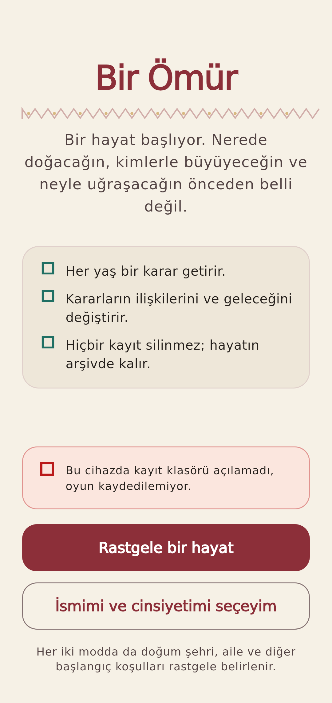
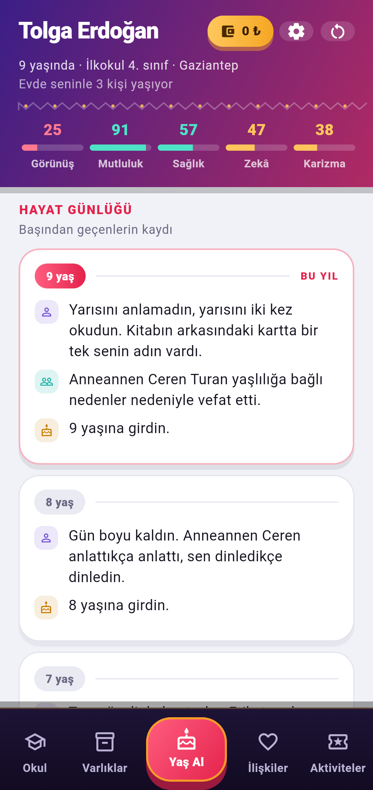
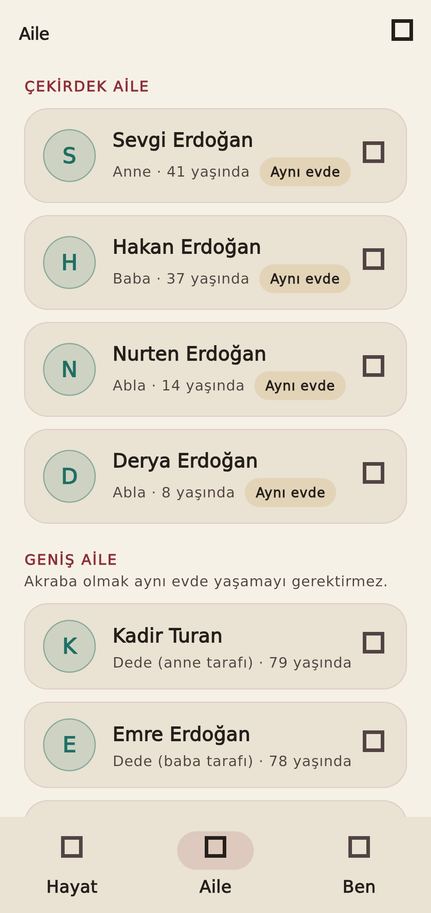
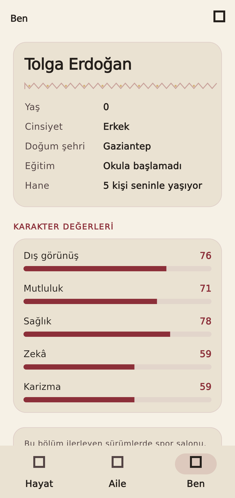
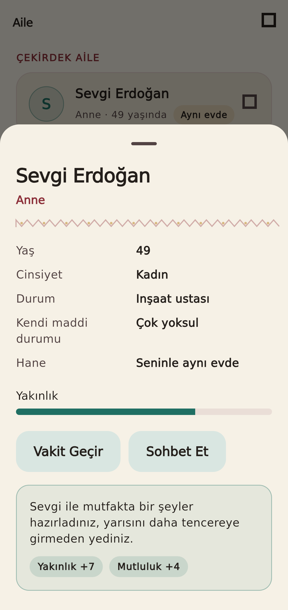
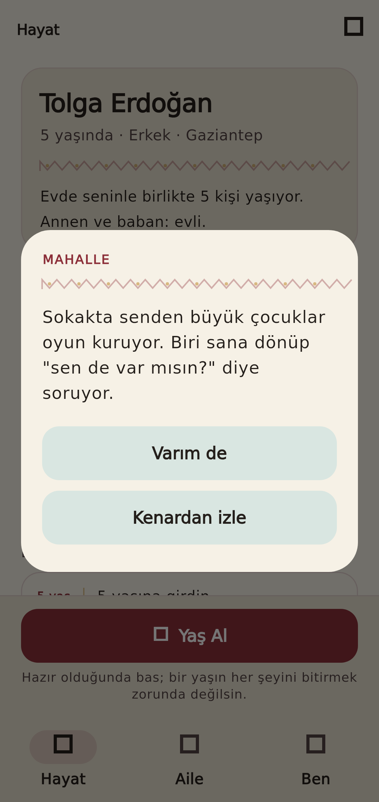
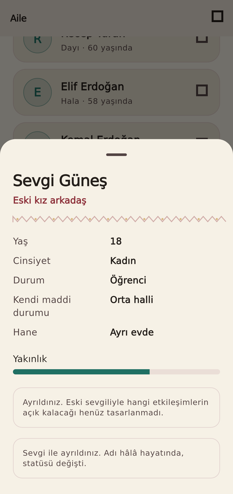
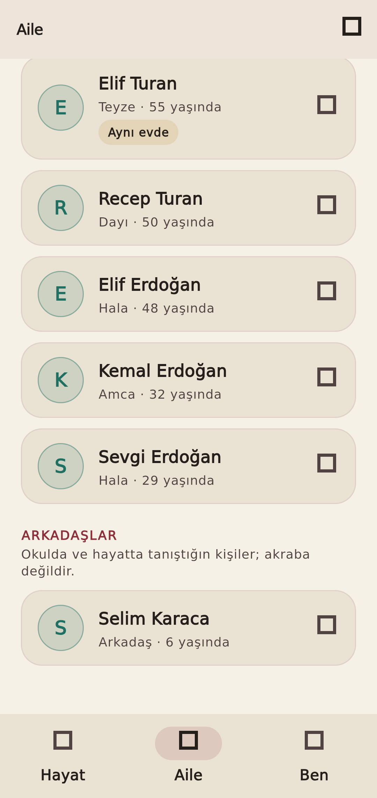

# Prototip ekran görüntüleri (Aşama 1-4 + okul paketi)

Bu görüntüler `flutter test --update-goldens` ile **gerçek widget ağacından**
üretilmiştir. Yeniden üretmek için:

```bash
cd app
BIR_OMUR_SCREENSHOTS=1 flutter test --update-goldens test/golden_screens_test.dart
```

> **Bunlar cihaz testi değildir.** Android APK bu ortamda derlenemedi
> (ağ politikası Android SDK indirmesini engelliyor), dolayısıyla aşağıdaki
> görüntüler emülatör veya gerçek telefon çıktısı yerine geçmez. Ayrıca test
> ortamı ikon yazı tipini yüklemediği için **ikonlar boş kare** görünür;
> gerçek derlemede normal çizilirler.
>
> **Görsel tasarım onaylanmadı.** Bu ekranlar teknik iskeleti gösterir;
> marka tasarımı olarak sunulmamıştır. Açık tartışma:
> [`docs/DESIGN_REVIEW_QUEUE.md`](../../../docs/DESIGN_REVIEW_QUEUE.md) → Q-001.

## 01 — Başlangıç: iki oyun başlatma modu


## 02 — Hayat: karakter özeti, değerler, hayat günlüğü ve Yaş Al


## 03 — Aile: çekirdek/geniş aile, "Aynı evde" rozeti


## 04 — Ben: kimlik bilgileri ve beş karakter değeri


## 05 — Aile etkileşimi: Vakit Geçir sonucu ve uygulanan değişimler


## 06 — Yaş Al sonrası çıkan tek açılış olayı


## 07 — Ayrılıktan sonra aynı kişi eski sevgili olarak kalıyor


## 08 — Okulda tanışılan arkadaş, Aile listesinde ayrı bölümde

