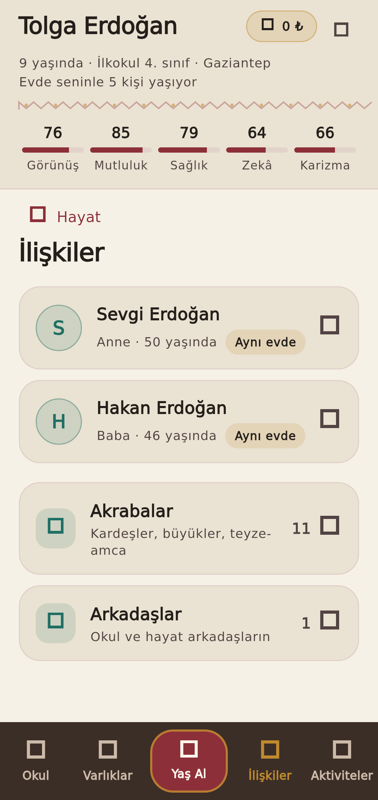
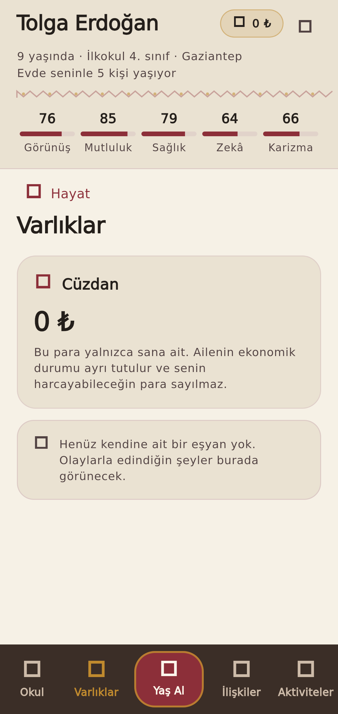
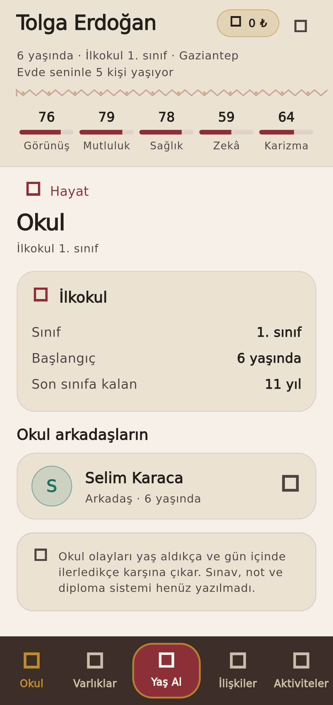
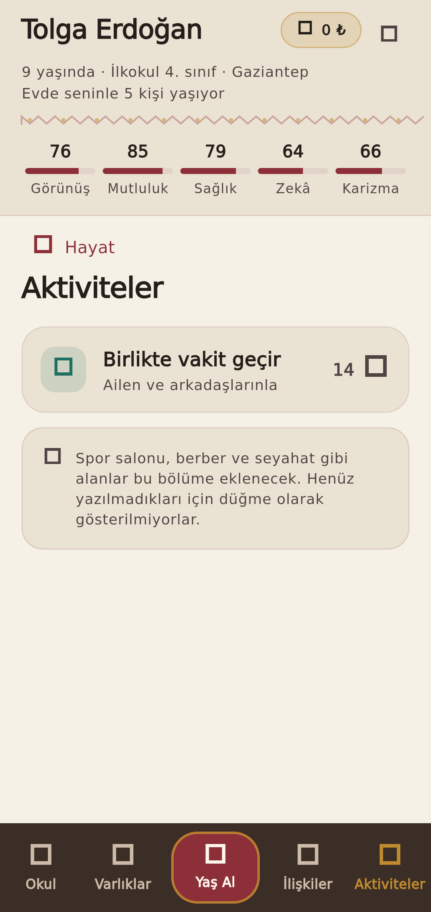
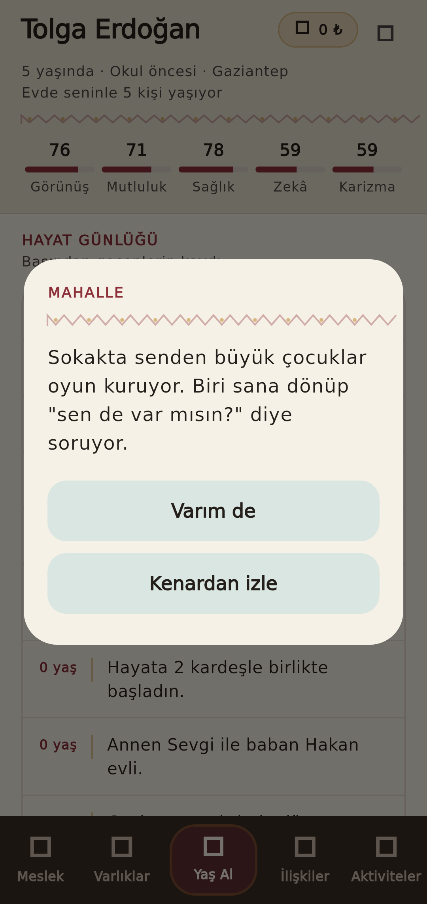
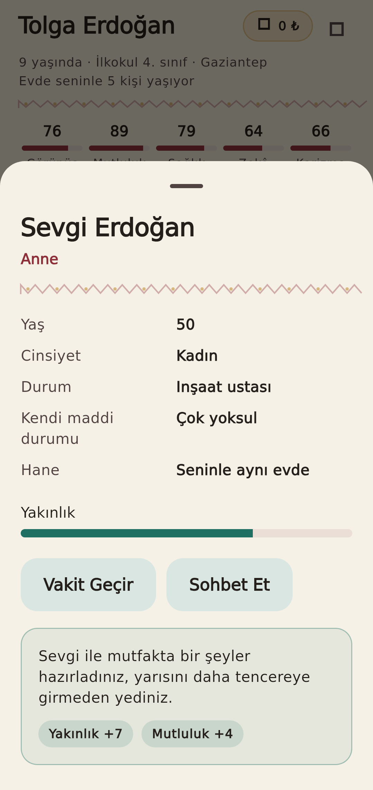
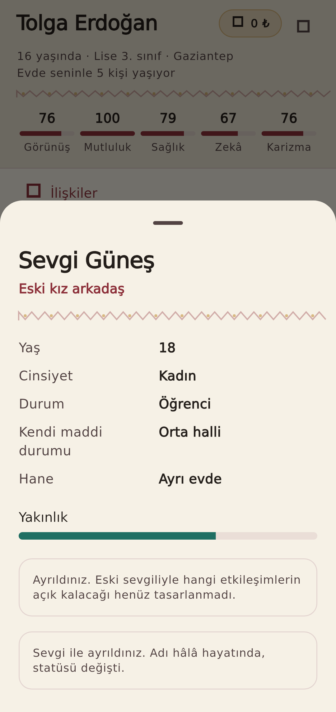

# Prototip ekran görüntüleri (menü + arayüz revizyonu)

Bu görüntüler `flutter test --update-goldens` ile **gerçek widget ağacından**
üretilmiştir. Yeniden üretmek için:

```bash
cd app
BIR_OMUR_SCREENSHOTS=1 flutter test --update-goldens test/golden_screens_test.dart
```

> **Bunlar cihaz testi değildir.** Android APK bu ortamda derlenemedi
> (ağ politikası Android SDK indirmesini engelliyor), dolayısıyla aşağıdaki
> görüntüler emülatör veya gerçek telefon çıktısı yerine geçmez. Ayrıca test
> ortamı ikon yazı tipini yüklemediği için **ikonlar boş kare** görünür;
> gerçek derlemede normal çizilirler.
>
> **Görsel yön hâlâ onay bekliyor.** Bu düzen NAV-001 gezinme kararını
> uygulayan bir **öneridir**; marka tasarımı olarak kesinleşmiş değildir.
> Açık tartışma: [`docs/DESIGN_REVIEW_QUEUE.md`](../../../docs/DESIGN_REVIEW_QUEUE.md) → Q-001.

## 01 — Başlangıç: iki oyun başlatma modu


## 02 — Ana ekran: üst karakter özeti, hayat günlüğü, alt menü ve ortadaki Yaş Al


## 03 — İlişkiler: anne ve baba en üstte, altında alt menüler


## 04 — Varlıklar: kişisel cüzdan, eşyalar ve evcil hayvanlar


## 05 — Okul: kademe paneli ve okul arkadaşları


## 06 — Aktiviteler: iç içe menü


## 07 — Yaş alınca çıkan tek açılış olayı


## 08 — Kişi detayı ve etkileşim sonucu


## 09 — Ayrılıktan sonra aynı kişi eski sevgili olarak kalıyor

